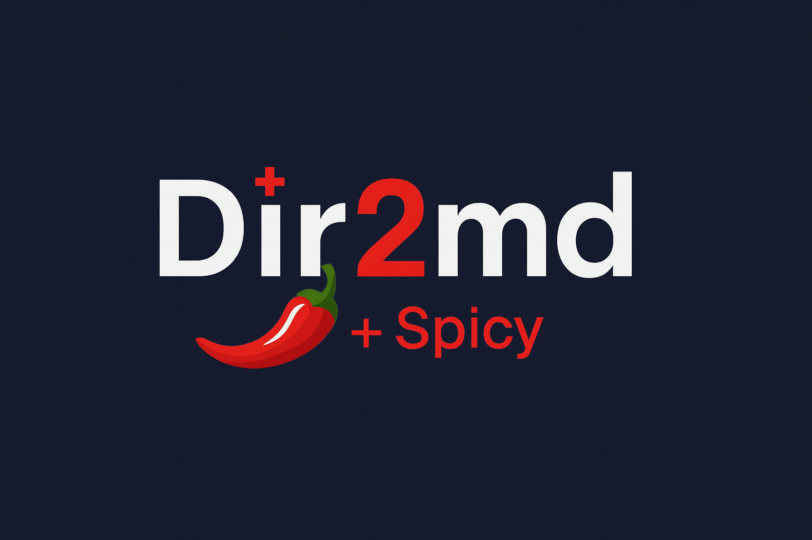

# Dir2md +spicy



[](https://opensource.org/licenses/MIT)
[](https://www.python.org/downloads/)
[](.github/workflows/release.yml)
[](#sidrce-certification)

> Transform your codebase into LLM-optimized markdown blueprints.

Dir2md analyzes directory structures and generates comprehensive markdown documentation optimized for large language models. It intelligently samples content, removes duplicates, and provides token-budget control to create the perfect context for AI-assisted development.

**Legend**: [*] Core Feature | [#] Security | [!] Performance | [T] Configuration | [+] User Experience | [o] Fresh in this release

## 1.1.0 Highlights

- **[*] Fast preset**: `--fast` builds tree + manifest only (no file reads) for ultra-light contexts.
- **[o] AI-friendly defaults**: `--ai-mode` with capped budgets, stats, manifest on; `--query` ranks files and injects snippets.
- **[+] Dual outputs by default**: Generates human `md` and LLM-friendly `jsonl` together unless you choose `--output-format`.
- **[#] Spicy risk report**: `--spicy` adds 5-level findings to md/json/jsonl/manifest; `--spicy-strict` fails on high/critical.
- **[T] CLI polish**: `[LEVEL]` status lines, `--progress none|dots|full`, timestamped `*_blueprint[_spicy]_YYYYMMDD` filenames.
- **[&] Architecture**: Introduced `walker.py`, `selector.py`, `renderer.py`, `orchestrator.py` to reduce `core.py` coupling.
- **[W] Release**: Added PyPI/TestPyPI release workflow and Docker usage notes.

## Key Features (with fresh highlights)

- **[*] Smart Content Sampling**: Head/tail sampling with configurable token budgets.
- **[*] Duplicate Detection**: SimHash-based deduplication to reduce noise.
- **[#] Security First**: Enhanced secret masking for PEM blocks, AWS keys, bearer tokens, GitHub PATs, generic API keys, database URLs, JWTs, and OAuth secrets.
- **[#] Custom Masking**: Add project-specific regular expressions via CLI flags, pattern files, or `pyproject.toml`.
- **[o] Fresh**: `--fast` tree+manifest mode, default dual outputs (md + jsonl), spicy 5-level risk report with `--spicy` / `--spicy-strict`.
- **[o] Fresh**: Modular pipeline (`walker`, `selector`, `renderer`, `orchestrator`) for lower coupling and easier extension.
- **[!] Multiple Output Modes**: Reference, summary, or full inline content.
- **[T] Highly Configurable**: Extensive filtering and customization options.
- **[+] Developer Friendly**: Raw mode default for complete code visibility.

## Why Dir2md?

Traditional documentation approaches fall short when working with AI assistants:

- Too much noise: raw `tree` plus `cat` includes irrelevant files.
- Token waste: unoptimized content hits LLM context limits.
- Security risks: accidental exposure of secrets and keys.

## Quick Start

### Try It Online

**[Try dir2md Demo on Hugging Face Spaces](https://huggingface.co/spaces/Flamehaven/dir2md-demo)**

Experience dir2md instantly in your browser:
- Convert any GitHub repository to markdown.
- See real-time directory structure analysis.
- Download generated markdown blueprints.
- No installation required.

### Installation

```bash
# From PyPI (stable version by IsaacBreen)
pip install dir2md

# Flamehaven's enhanced version (LLM-optimized features)
git clone https://github.com/Flamehaven/dir2md.git
cd dir2md
pip install -e .  # Install in editable/development mode
dir2md --help     # CLI now available globally

# Or run directly without installation
python -m src.dir2md.cli --help
```

### Basic Usage

```bash
# Generate project blueprint (developer-friendly raw mode)
dir2md .

# With enhanced security masking (private keys, AWS keys, tokens)
dir2md . --masking basic

# Generate with manifest for CI/CD
dir2md . --emit-manifest --no-timestamp

# Token-optimized for LLM context
dir2md . --budget-tokens 4000 --preset pro
```

#### pyproject.toml defaults

Dir2md reads `[tool.dir2md]` from the nearest `pyproject.toml` so teams can share default presets, budgets, filters, and masking rules.

```toml
[tool.dir2md]
preset = "pro"
include_glob = ["src/**/*.py", "tests/**/*.py"]
exclude_glob = ["**/__pycache__/**"]
emit_manifest = true

[tool.dir2md.masking]
patterns = ["(?i)secret_key\\s*=\\s*['\\\"]?[A-Za-z0-9]{16,}['\\\"]?"]
pattern_files = ["file://./.dir2md/patterns.txt"]
```

Patterns use gitignore-style `gitwildmatch` semantics. Command-line flags still override any value loaded from the configuration file.

### Custom Masking Patterns

Dir2md supports project-specific secret patterns through multiple methods:

**Inline patterns** (repeatable flag):
```bash
dir2md . --mask-pattern "(?i)stripe_key\\s*=\\s*['\"]?sk_live_\\w+['\"]?"
```

**Pattern files** (JSON or text format):
```bash
# patterns.json (JSON array format)
["(?i)custom_token:\\s*[A-Za-z0-9_-]{32,}",
 "(?i)internal_key=\\S+"]

# patterns.txt (newline-delimited format)
(?i)stripe_key\s*=\s*['\"]?sk_live_\w+['\"]?
(?i)mailgun_api_key\s*=\s*['\"]?key-[a-z0-9]{32}['\"]?

# Load with file:// URI
dir2md . --mask-pattern-file file://./patterns.json
```

**Configuration file** (`pyproject.toml`):
```toml
[tool.dir2md.masking]
patterns = ["(?i)secret_key\\s*=\\s*[A-Za-z0-9]{16,}"]
pattern_files = ["file://./.dir2md/patterns.txt"]
```

**Masking specifics**:
- Custom rules run before built-in masking (project overrides win).
- Invalid regexes are skipped with warnings; other rules continue.
- Supports JSON arrays, JSON objects with `patterns` key, or newline-delimited text.
- Cross-platform `file://` URI support (Windows: `file:///C:/path`, Unix: `file:///path`).

### Output Example

```markdown
# Project Blueprint

- Root: `/path/to/project`
- Generated: `2025-09-08 12:30:15`
- Preset: `raw`
- LLM mode: `inline`
- Estimated tokens (prompt): `6247`

## Directory Tree
[Complete file structure]

## Statistics
| Metric | Value |
|--------|-------|
| Total files | 42 |
| Estimated tokens | 6247 |

## File Contents
[Intelligently sampled content...]
```

## Available Presets

| Preset | Token Budget | LLM Mode | Dedup | Best For |
|--------|--------------|----------|-------|----------|
| `raw` | Unlimited | inline | Off | Development, full code review |
| `pro` | User-defined | User-defined | Custom | Production use, CI/CD, tuned budgets |
| `ai` | ≤4000 (cap) | ref | 16-bit | LLM context prep with query prioritization |
| `fast` | n/a | off | 16-bit | Tree + manifest only (no contents), ultra-lightweight |

## Limitations (Current OSS Build)
- The `raw` preset always forces `--emit-manifest` off; select `pro` when you need manifest output.
- This enhanced version is distributed via GitHub only; the PyPI `dir2md` package is maintained separately by IsaacBreen with different features.
- README references Pro-only capabilities (advanced masking, parallel processing, export formats) that are not implemented in this repository.

## Open-Core Model

### Free (OSS) Features
- Complete directory analysis.
- Token optimization and sampling.
- SimHash deduplication.
- Enhanced security masking (AWS access keys, bearer tokens, private keys, GitHub PATs, generic API keys, database URLs, JWTs, OAuth secrets).
- All output modes and presets.
- Deterministic builds.

### Pro Features
- Advanced security masking (additional cloud and SaaS patterns).
- Parallel processing and caching.
- Language-specific analysis plugins.
- HTML/PDF export options.
- Team integration (CI/CD, PR bots).
- Priority support.
- Pricing and licensing: Open and free to use; see `FEATURES.md` for capability notes.

[Learn more about Pro features](FEATURES.md)

## Documentation

- **[Feature Comparison](FEATURES.md)** - Complete OSS vs Pro breakdown.
- **[Current Status](CURRENT_FEATURES.md)** - What's implemented now.
- **[Usage Examples](USAGE_EXAMPLES.md)** - Hands-on guide with examples.

## CLI Reference

```bash
# Basic options
dir2md [path] -o output.md --preset [pro|raw|ai|fast]

# Token control
--budget-tokens 6000          # Total token budget
--max-file-tokens 1200        # Per-file token limit
--sample-head 120             # Lines from the file start
--sample-tail 40              # Lines from the file end

# Filtering
--include-glob "*.py"         # Gitignore-style include (gitwildmatch)
--exclude-glob "**/__pycache__/**"  # Gitignore-style exclude
--omit-glob "tests/**"        # Omit content but keep tree
--only-ext "py,js,ts"         # File extensions only

# Security
--masking [off|basic|advanced]         # Secret masking level (advanced requires Pro)
--mask-pattern "api_key\\s*=\\s*['\\\"]?[A-Za-z0-9]+['\\\"]?"  # Repeatable custom regex
--mask-pattern-file file://./patterns.json  # Load regex patterns (JSON array or newline list)

# Output
--emit-manifest              # Generate JSON metadata
--no-timestamp              # Reproducible output
--dry-run                   # Preview without writing
```

Note: the `raw` preset always forces `--emit-manifest` off. Use the `pro` preset with manual flags if you need inline output plus a manifest.

## Contributing

We welcome contributions! Dir2md follows an open-core model:

- Core functionality: open source (this repo).
- Advanced features: commercial (separate repo).
- Community: all discussions welcome.

### Development Setup

```bash
git clone https://github.com/Flamehaven/dir2md.git
cd dir2md
pip install -e ".[dev]"  # Install with dev dependencies
python -m pytest -v      # Run tests (12 tests should pass, 1 may skip)
python -m src.dir2md.cli . --dry-run  # Test CLI
```
Note: current automated tests are concentrated in `tests/test_dir2md.py`; adding module-level unit tests will improve stability.

### Reporting Issues

- Bug reports: [GitHub Issues](https://github.com/Flamehaven/dir2md/issues)
- Feature requests: [GitHub Discussions](https://github.com/Flamehaven/dir2md/discussions)
- Security issues: info@flamehaven.space

## Troubleshooting

### Common Issues

**Pattern file not loading (Windows)**
```bash
# Error: [WARN] Could not read mask pattern file
# Fix: Use proper file:// URI format
dir2md . --mask-pattern-file file:///C:/path/to/patterns.json  # Note the triple slash
```

**File encoding errors**
```bash
# Error: UnicodeDecodeError or cp949 codec errors
# Fix: Ensure files are UTF-8 encoded, or exclude problematic files
dir2md . --exclude-glob "**/*.bin" --exclude-glob "**/*.dat"
```

**Token budget exceeded**
```bash
# Symptom: Output is truncated or incomplete
# Fix: Increase budget or use more aggressive filtering
dir2md . --budget-tokens 10000 --only-ext "py,js,md"
```

**Manifest not generated**
```bash
# Symptom: .manifest.json file missing
# Cause: raw preset disables manifests by default
# Fix: Use pro preset or explicitly enable
dir2md . --preset pro --emit-manifest

### AI CLI examples (default: md+json generated together)

Claude / Cursor (JSONL for easy paste):
```bash
dir2md . --ai-mode --query "payment flow" --output-format jsonl --spicy > ctx.jsonl
```

Gemini (lean manifest + query match):
```bash
dir2md . --ai-mode --query "auth token handling" --emit-manifest --output-format json --spicy > ctx.json
```

Raw code slice for local agents:
```bash
dir2md . --preset raw --masking basic --budget-tokens 4000
```

### Spicy risk report
- Enable spicy findings: `--spicy`
- Enforce failure on high/critical: `--spicy --spicy-strict` (exit code 2)
- Outputs:
  - `md` (human-friendly): includes “Spicy” section
  - `json`/`jsonl`/manifest (LLM-friendly): `spicy.score`, `spicy.counts`, `spicy.findings[]`
Severity levels: ok, warn, risk, high, critical.

## Docker
Build:
```bash
docker build -t dir2md:local .
```
Run (human md + jsonl, spicy on):
```bash
docker run --rm -v %cd%:/work dir2md:local /work --spicy
```
(Replace `%cd%` with `$PWD` on Linux/macOS.)

## Publishing
- PyPI/TestPyPI release via GitHub Actions: `Release` workflow (manual dispatch).
- Required secrets: `PYPI_API_TOKEN`, `TEST_PYPI_API_TOKEN`.
- Local build: `python -m build && twine upload dist/*`
```

**Secrets still visible in output**
```bash
# Symptom: API keys or tokens not masked
# Fix: Verify masking mode is enabled and pattern matches
dir2md . --masking basic --dry-run  # Test first
# Add custom pattern if needed
dir2md . --masking basic --mask-pattern "your_custom_pattern"
```

### Getting Help

For additional support:
- Check [Usage Examples](USAGE_EXAMPLES.md) for detailed scenarios
- Review [Feature Documentation](FEATURES.md) for capability reference
- Search [GitHub Issues](https://github.com/Flamehaven/dir2md/issues) for similar problems

## SIDRCE Certification

- **Certification ID**: SIDRCE-DIR2MD-20251203-Ω-ARCHON  
- **Scores**: Integrity 98, Resonance 95, Stability 95, Ω-Score 96 (Certified)  
- The spicy refactor distributed responsibilities across `walker`, `selector`, `renderer`, and `orchestrator`, eliminating the former god-object risk.  
- pytest defaults are captured in `pytest.ini` (cache_dir, pythonpath) to keep runs deterministic across environments.
- Join discussions in [GitHub Discussions](https://github.com/Flamehaven/dir2md/discussions)

## Acknowledgments

This project shares its name with [IsaacBreen's dir2md](https://pypi.org/project/dir2md/), a simpler directory-to-markdown conversion tool available on PyPI. Our enhanced version focuses on LLM optimization, token budgeting, and advanced security masking for AI-assisted development workflows. Both tools serve different use cases in the ecosystem.

## License

This project is licensed under the MIT License - see the [LICENSE](LICENSE) file for details.

Pro features are available under a separate commercial license.

---


Made with care by Flamehaven for developers who want their AI to understand their code.
